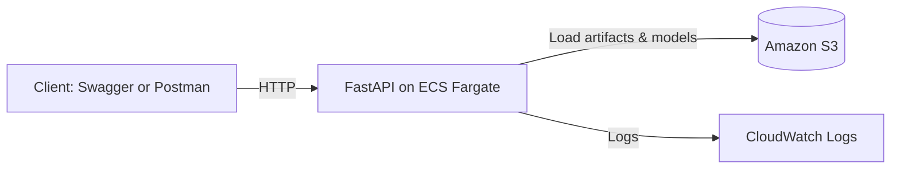

# Predicting Late Shipments: An End-to-End Machine Learning Project


## Project Overview

Timely delivery is a critical factor in supply chain management, as late shipments can lead to customer dissatisfaction, revenue loss, and increased operational costs. In this project, I use machine learning to develop predictive models for a global sports and outdoor equipment retailer to proactively identify high-risk shipments before delays occur.

The project follows modern best practices in data science and machine learning development:

- **Modular pipeline**: Cleanly separated stages for loading, cleaning, feature engineering, preprocessing, training, and evaluation.
- **MLflow integration**: Tracks experiments and hyperparameter tuning for reproducibility.
- **REST API deployment**: Trained models are served using **FastAPI**, packaged in a **Docker** container, stored in **Amazon ECR**, and deployed on **Amazon ECS Fargate** with artifacts loaded from **Amazon S3**.
- **Automated testing**: FastAPI routes are verified using **pytest**, including landing page, health check, and prediction endpoints.
- **Structured logging**: Unified logging system records progress and errors for easier debugging and traceability.
- **Exploratory data analysis (EDA)**: Initial insights and feature selection decisions are documented in a dedicated Jupyter notebook.

**Tech Stack Overview:**

- **Core Python & ML**: `Python 3.11`, `pandas`, `NumPy`, `scikit-learn`, `joblib`, `RobustScaler`, `OneHotEncoder`, `OrdinalEncoder`  
- **API & Deployment**: `FastAPI`, `Pydantic`, `Uvicorn`, `Docker`, `pytest`  
- **Experiment Tracking**: `MLflow`  
- **Infrastructure (AWS)**: `Amazon ECS (Fargate)`, `Amazon ECR`, `Amazon S3`, `AWS IAM`, `Amazon CloudWatch`
- **CI/CD & Automation**: `GitHub Actions` (CI: tests on PRs, CD: Docker build & ECS deploy)
- **Utilities**: `logging`, `pathlib`, `datetime`  

Together, these tools support a modular, reproducible, and production-ready ML workflow.

## Dataset Information

The data for this project is provided by DataCo and is publicly available on Kaggle ([link](https://www.kaggle.com/datasets/shashwatwork/dataco-smart-supply-chain-for-big-data-analysis)). It contains approximately 180,000 transactions that are shipped to 164 unique countries over the span of three years. The dataset provides a comprehensive view of supply chain operations, including:
- **Order details:** Order IDs, order destination, and order dates.
- **Product information:** Product IDs, pricing, and sales.
- **Customer data:** Customer segment and locations.
- **Shipping records:** Scheduled vs. actual delivery times, shipping mode, and delivery status.

## Business Problem

The dataset reveals that 57% of completed shipments are late by at least one day, and more than 7% are delayed by three or more days. To improve on-time delivery rates, businesses need to identify high-risk shipments early and take proactive measures to mitigate delays.

## Solution Approach

To address the challenge of shipment delays, this project builds machine learning models that classify whether a shipment will arrive late or very late. These predictive tools help prioritize shipments that require early intervention or adjusted logistics handling.

Two Random Forest classifiers were trained:
1. **Late Order Model (optimized for accuracy)**  
   Predicts whether an order will be delivered late (by at least one day).

2. **Very Late Order Model (optimized for recall)**  
   Predicts whether an order will be three or more days late prioritizing recall to flag high-risk shipments early in the process.

## Model Performance

Two Random Forest models were developed and evaluated on a hold-out test set (25% of the dataset), with each optimized for a metric aligned to its business use case.

- **Late Shipment Model (optimized for accuracy):**
  - **Test Accuracy:** 86.14%

- **Very Late Shipment Model (optimized for recall):**
  - **Test Recall:** 97.58%
  - **Average Precision Score:** 95.49% (Threshold: 0.3)

The late model provides broad classification coverage of delayed shipments, while the very late model prioritizes capturing as many high-risk cases as possible. Together, they support more proactive and targeted logistics interventions.

## Project Architecture

The repository follows a modular, production-ready structure designed for clarity, reproducibility, and scalability. Key components include data preprocessing scripts, model training modules, a containerized FastAPI application, and automated tests. Below is an overview of the file and folder organization:

```text
late-shipment-predictions-ml/
│
├── README.md                # Project overview, setup instructions, and deployment details
├── requirements.txt         # Python dependencies for local and container environments
├── env.example              # Example environment file (set UPLOAD_TO_S3=false for local retraining)
├── Dockerfile               # Container definition for FastAPI app (used in ECS deployment)
├── run_pipeline.py          # Local execution script for the full ML workflow: data loading, feature engineering, training, and evaluation
├── retrain_pipeline.py      # Prefect-orchestrated retraining pipeline (data prep → model updates → optional S3 uploads)
│
├── api/                     # FastAPI application and endpoint logic
│   ├── main.py
│   └── shipment_schema.py
│
├── assets/                  # Proof artifacts (screenshots)
│   ├── swagger/             # API Swagger UI (docs, ping, predict endpoints)
│   ├── orchestration/       # Prefect orchestration proof (MLflow runs, S3 versioning, retrain flow logs)
│   └── ci_cd/               # CI/CD pipeline and deployment proof (Actions runs, ECS revision, CloudWatch logs)
│
├── data/                            # Data storage directory
│   ├── raw/                         # Contains raw shipment data (included)
│   │   └── shipments_raw.csv        # Main dataset used as pipeline input
│   ├── unprocessed/                 # Generated intermediate data after cleaning
│   │   └── X_unprocessed.pkl        # Data snapshot before encoding and scaling
│   ├── preprocessed/                # Final features used for model training
│   │   ├── X_train.pkl
│   │   ├── X_test.pkl
│   │   ├── y_late_train.pkl
│   │   ├── y_late_test.pkl
│   │   ├── y_very_late_train.pkl
│   │   └── y_very_late_test.pkl
│   └── docs/                        # Supporting documentation
│       └── variable_description.csv # Column descriptions and definitions
│
├── infra/                                   # Infrastructure blueprints for AWS ECS/Fargate deployment
│   ├── diagrams/
│   │   └── architecture.png                       # Architecture diagram of CI/CD flow: Actions → ECR → ECS/Fargate tasks → S3 artifacts + CloudWatch logs
│   ├── iam/
│   │   ├── policies/
│   │   │   ├── GitHubActionsDeployPolicy.json     # Permissions for GitHubActionsDeployRole (ECR push, ECS deploy, PassRole)
│   │   │   └── LateShipmentArtifactsReadOnly.json # Least-privilege S3 read access for ECS task role
│   │   ├── roles/
│   │   │   ├── ECSLateShipmentTaskRole.md         # Notes on app task role and attached S3 read-only policy
│   │   │   ├── ECSTaskExecutionRole.md            # Notes on execution role (AmazonECSTaskExecutionRolePolicy)
│   │   │   └── GitHubActionsDeployRole.md         # Notes on deploy role assumed by GitHub Actions (trust + policy)
│   │   └── trust/
│   │       └── github_actions_oidc.json           # Trust policy allowing GitHub Actions (via OIDC) to assume deploy role
│   ├── render/                                    # Location where CI/CD renders the updated task definition before registering it
│   └── taskdef.template.json                      # ECS Task Definition template (placeholder image, roles, ports, logging, CPU/memory)
│
├── logs/
│   └── pipeline.log         # Logs from local pipeline runs (production logs handled by CloudWatch)
│
├── mlruns/                  # MLflow experiment tracking (created during tuning, not included by default)
│
├── models/                  # Trained ML models and preprocessing artifacts
│   ├── late_model.pkl          # Random Forest model predicting late shipments (1+ days)
│   ├── very_late_model.pkl     # Random Forest model predicting very late shipments (3+ days)
│   ├── onehot_encoder.pkl      # Encoder for nominal categorical features
│   ├── ordinal_encoder.pkl     # Encoder for ordinal categorical features
│   └── scaler.pkl              # Scaler for numeric feature normalization
│
├── notebooks/               # Exploratory Data Analysis (EDA)
│   └── eda.ipynb                # Initial data exploration, feature trends, and target imbalance visualization
│
├── routers/                 # FastAPI route definitions
│   ├── landing.py              # Defines the root ("/") endpoint with a landing page message
│   ├── ping.py                 # Health check endpoint ("/ping") for uptime monitoring
│   ├── predict_late.py         # Endpoint for predicting late shipments (1+ day delay)
│   └── predict_very_late.py    # Endpoint for predicting very late shipments (3+ day delay)
│
├── src/                     # Core logic for the machine learning pipeline
│   ├── load_data.py              # Loads raw shipment data from CSV into a DataFrame
│   ├── clean_data.py             # Cleans missing values, handles duplicates, and filters irrelevant rows
│   ├── feature_engineering.py    # Generates predictive features (e.g., shipping duration, delivery gaps)
│   ├── preprocess_features.py    # Splits data, encodes categorical variables, scales features, and saves transformers
│   ├── train_late_model.py       # Trains Random Forest classifier to predict late shipments (optimized for accuracy)
│   ├── train_very_late_model.py  # Trains separate Random Forest classifier for very late shipments (optimized for recall)
│   └── logger.py                 # Centralized logger for consistent logging across all modules
│
├── tests/                             # Automated tests for validating the API
│    ├── integration/                    # Tests that hit real services (e.g., S3, full prediction flow)
│    │   ├── conftest.py                   # Shared fixtures/utilities for integration tests
│    │   ├── test_predict_late.py          # Verifies /predict_late endpoint with real artifacts (1+ day delay)
│    │   └── test_predict_very_late.py     # Verifies /predict_very_late endpoint with real artifacts (3+ day delay)
│    └── smoke/                         # Lightweight checks for API health
│        └── test_main.py                 # Smoke tests for basic routes (/, /ping) to confirm service is up
│
└── tuning/                  # Model tuning scripts with MLflow experiment tracking
    ├── tune_late_model.py       # Tunes Random Forest for predicting 1+ day late shipments (optimized for accuracy)
    └── tune_very_late_model.py  # Tunes Random Forest for 3+ day late shipments (optimized for recall)
```

## Installation and Running the Pipeline

This project includes a complete **machine learning pipeline** for predicting shipment delays. The pipeline prepares the data and trains two models: one for **"late"** deliveries and one for **"very late"** deliveries.

Key pipeline features:
- Fully automated script: `run_pipeline.py`
- Cleans and transforms raw shipment data
- Trains two separate classification models
- Saves preprocessing tools and model files to the `models/` directory
- Console logging for easy progress tracking

**To get started:**
1. Make sure Python 3.11+ is installed on your system.
2. (Optional but recommended) Create and activate a virtual environment.
3. Install dependencies by running:
   ```bash
   pip install -r requirements.txt
   ```
4. Execute the pipeline script:
   ```bash
   python run_pipeline.py
   ```

**Note:**
Running the pipeline will generate two model files:
- `models/very_late_model.pkl`
- `models/late_model.pkl`

These models are used by the FastAPI app for inference via the `/predict_very_late` and `/predict_late` endpoints.

## Configuration

### Environment Variables (minimal setup)
This project uses environment variables for configuration, but setting them up is **only necessary if you plan to run the retraining pipeline**.  
The retraining pipeline is used when updating the project with new raw shipment data and optionally uploading new model artifacts to Amazon S3.

If you want to run it locally, follow these steps:

1. Copy the provided example file to create your own `.env`:
   ```bash
   cp env.example .env
   ```
2. Open the new `.env` file and make sure this line is set:
   ```bash
   UPLOAD_TO_S3=false
   ```
   
   This setting is important because the pipeline includes optional logic to upload newly trained models and preprocessing artifacts to S3.
   Setting `UPLOAD_TO_S3=false` ensures that your local run saves all outputs only to your local folders (`models/` and `data/`) and does not attempt any AWS uploads.

   You do not need to configure any AWS credentials or S3 settings to run the project locally.
   Those variables are only required if you later deploy or test the pipeline in the cloud with `UPLOAD_TO_S3=true`.


## Deployment

This project includes a deployable **REST API** built with **FastAPI**, allowing users to interact with a trained machine learning model via HTTP requests.

### Key deployment features
- **Containerized with Docker** and stored in **Amazon ECR**
- Deployed on **Amazon ECS Fargate** (serverless container service) within a managed cluster
- **Models and preprocessing artifacts** are loaded securely from **Amazon S3**
- **FastAPI** application serves prediction endpoints for both the **"late"** (≥1 day) and **"very late"** (≥3 days) shipment models
- **Interactive API documentation** available via **Swagger UI** at `/docs`
- **Schema validation** is implemented using Pydantic models to ensure input correctness
- A **/ping** route is included for uptime and health monitoring
- **Logs** from the service are streamed to **Amazon CloudWatch** for observability

### Cloud Architecture (high level)

The client (Swagger/Postman) calls a FastAPI container on ECS Fargate.  
At startup the app loads **preprocessing artifacts and models** from Amazon S3.  
Runtime logs go to CloudWatch.



### Deployment Steps (AWS ECS Fargate)

To reproduce this deployment yourself:

1. **Build and tag the Docker image**

   ```powershell
   $ACCOUNT_ID = "<your_aws_account_id>"
   $REGION     = "<aws_region>"   # e.g., eu-north-1
   $REPO       = "<your_repo_name>"   # e.g., late-shipment-api
   $REPO_URI   = "$ACCOUNT_ID.dkr.ecr.$REGION.amazonaws.com/$REPO"
   $TAG        = (Get-Date -Format "yyyy-MM-dd-HHmm")

   docker build -t "${REPO}:${TAG}" .
   docker tag "${REPO}:${TAG}" "${REPO_URI}:${TAG}"
   docker push "${REPO_URI}:${TAG}"
   ```

2. **Update ECS service**
- Go to the ECS console → select your service → Update
- Paste the new image URI, for example:
  <account_id>.dkr.ecr.<region>.amazonaws.com/<repo_name>:<tag>
- Check Force new deployment and confirm.

3. **Verify logs in CloudWatch**
- Look for startup logs showing that the scaler, encoders, and models are loaded from S3.

4. **Test the API**
- Open `http://<public_ip>:8000/docs` in a browser.
- Try `/ping` (should return `200`).
- Try `/predict_late/` with the sample JSON provided below.

### Proof of Deployment

Below are screenshots confirming the service is deployed, responding to requests, and serving predictions.

- **Startup logs in CloudWatch** showing that all artifacts (scaler, encoders, models) were loaded from S3
 
  

- **Landing page** served by FastAPI

  

- **Ping endpoint** responding successfully (`{"status":"ok"}`)
 
  

- **Interactive API docs** available via Swagger UI

  

- **Prediction endpoint** returning a valid response (`late_prediction: 1`)
 
  

- **Very Late prediction endpoint** returning a valid response (`very_late_prediction: 0/1`)

  


## Using the Deployed API

**Note:** The live service is currently paused (scaled to 0 on AWS ECS Fargate) to avoid unnecessary costs.  
You can still reproduce the deployment by following the steps in this repository.  
A stable public endpoint will be provided in **January 2026**.

To try out the deployed FastAPI app on AWS:

1. Open the Swagger UI in your browser at the service’s public IP:
   `http://<PUBLIC_IP>:8000/docs`

2. Locate either the `/predict_late/` or `/predict_very_late/` endpoint.

3. Click **"Try it out"**.

4. Paste the following sample JSON into the request body field:

```json
{
  "order_item_quantity": 4,
  "order_item_total": 181.92,
  "product_price": 49.97,
  "year": 2015,
  "month": 4,
  "day": 21,
  "order_value": 737.65,
  "unique_items_per_order": 4,
  "order_item_discount_rate": 0.09,
  "units_per_order": 11,
  "order_profit_per_order": 89.13,
  "type": "DEBIT",
  "customer_segment": "Home Office",
  "shipping_mode": "Standard Class",
  "category_id": 46,
  "customer_country": "EE. UU.",
  "customer_state": "MA",
  "department_id": 7,
  "order_city": "San Pablo de las Salinas",
  "order_country": "México",
  "order_region": "Central America",
  "order_state": "México"
}
```

5. Click **"Execute"**.

6. Scroll down to the **Response Body** to view the model prediction:
   - For /predict_late/ → 0 = Not late (less than 1 day), 1 = Late (1 or more days)
   - For /predict_very_late/ → 0 = Not very late (less than 3 days), 1 = Very late (3 or more days)

Note: Both endpoints use Random Forest classifiers. The late model is optimized for accuracy, while the very late model is optimized for recall to flag high-risk shipments.

## Orchestrated Retraining (Prefect + MLflow)
Once the initial model is deployed, maintaining performance over time becomes just as important as the original training.  
To ensure that new data or shifting shipment patterns can be incorporated seamlessly, the project includes a dedicated **retraining pipeline** (`retrain_pipeline.py`).

This pipeline is fully **orchestrated with Prefect** and tracked with **MLflow** for end-to-end experiment management, versioning, and artifact tracking.  
It automates every stage of the model lifecycle — from data ingestion to feature engineering, model training, and versioned deployment of new artifacts to Amazon S3.

Each retraining run:
1. Loads and cleans raw shipment data  
2. Engineers predictive features  
3. Preprocesses inputs and saves encoders/scalers  
4. Trains and evaluates the Late and Very Late Random Forest models  
5. Logs parameters, metrics, tags, and model signatures in **MLflow**  
6. Uploads versioned model artifacts and preprocessing files to **Amazon S3**

**MLflow Integration**
- Each model training step creates a new experiment run in MLflow with metrics (accuracy or recall), parameters, and model signatures. 
- Model artifacts and metadata are stored locally under `mlruns/` and can be visualized with:
   ```bash
   mlflow ui --backend-store-uri file:///path/to/project/mlruns
   ```
- Hyperparameter tuning is also integrated with MLflow, ensuring all experiments (training and tuning) are versioned and reproducible.

### Artifact Versioning
Each retraining run produces versioned artifacts stored in Amazon S3 with a unique timestamp:
  ```
  s3://late-shipments-artifacts-bengt/models/late_model/vYYYY-MM-DD_HH-MM/
  s3://late-shipments-artifacts-bengt/preprocessing/vYYYY-MM-DD_HH-MM/
  ```
After all versioned uploads complete, the pipeline automatically promotes the newest artifacts to a stable `latest/` location by copying and overwriting them:
  ```
  s3://late-shipments-artifacts-bengt/models/late_model/latest/late_model.pkl
  s3://late-shipments-artifacts-bengt/preprocessing/latest/scaler.pkl
  s3://late-shipments-artifacts-bengt/preprocessing/latest/onehot_encoder.pkl
  s3://late-shipments-artifacts-bengt/preprocessing/latest/ordinal_encoder.pkl
  ```
This ensures the FastAPI app on ECS always loads the most recent production-ready artifacts without needing to manually adjust S3 paths or redeploy logic.
Older versions remain preserved for traceability and rollback.

### Scheduling (Conceptual)
- The retrain pipeline can be scheduled via Windows Task Scheduler or Prefect Cloud for automated weekly retraining.
- For this project, retraining is executed manually to keep transparent and reproducible.

### Proof of Orchestrated Retraining
Below are screenshots demonstrating the retraining orchestration and tracking setup:

- **MLflow Experiment Tracking:**  
    
  The MLflow UI shows all four experiments created during the project — two for model tuning (*Late* and *Very Late Shipment Tuning*) and two for orchestrated retraining (*Late* and *Very Late Shipment Training*).  
  Each run logs model parameters, evaluation metrics, duration, and serialized artifacts.  
  This provides full experiment transparency and version control across both tuning and production retraining stages.  
  *(Accessed locally via [http://127.0.0.1:5000](http://127.0.0.1:5000); MLflow files are generated when the tuning or retraining pipelines are executed and are not included in the repository.)*

- **Versioned Artifacts in Amazon S3:**  
    
  
  
  The screenshots above show the automatically managed structure in the S3 bucket (`late-shipments-artifacts-bengt`).
  Each retraining run creates new date-stamped subfolders under models/ and preprocessing/ (e.g. `v2025-10-09_17-17/`) to preserve version history.
  After upload, the pipeline automatically promotes the newest artifacts to a stable `latest/` location (e.g. `models/late_model/latest/late_model.pkl`) used by the deployed API.
  This ensures ECS always loads the most recent production-ready models while older versions remain preserved for traceability and rollback.

- **Prefect Orchestrated Retraining Run:**  
    
    
  The console output from a full Prefect flow execution shows the retraining process from start to finish.  
  The first image captures flow initialization and early steps such as data loading and preprocessing.  
  The second shows the final stages, including S3 uploads and the confirmation  
  **“Flow run ... Finished in state Completed()”**, verifying that all orchestration, MLflow tracking, and artifact versioning executed successfully.  

## Testing the API Locally

This project uses **pytest** for automated testing. Tests are divided into two categories:

- **Smoke tests** (in `tests/smoke/`)  
  - Run automatically in CI on GitHub Actions.  
  - Check that the service starts and responds at `/` and `/ping`.  
  - These ensure deployments are not broken by basic errors.  

- **Integration tests** (in `tests/integration/`)  
  - Run locally (not in CI) because they require access to the S3 bucket with trained artifacts.  
  - Verify that /predict_late/ and /predict_very_late/ return valid predictions by loading preprocessing artifacts and models from the S3 bucket.

### Running Tests Locally

1. Set your working directory to the project root

2. Install dependencies:  
   ```bash
   pip install -r requirements.txt
   ```
3. Recreate model artifacts if needed:
   ```bash
   python run_pipeline.py
   ```
4. Run all tests:
   ```bash
   pytest
   ```

## CI/CD

This project uses GitHub Actions for both Continuous Integration (CI) and Continuous Deployment (CD):

- **Continuous Integration (CI)**  
  Every pull request and commit to `main` automatically triggers a workflow that installs dependencies and runs tests.  
  - Ensures the codebase remains stable.  
  - Provides immediate feedback when something breaks.  
  - 

- **Continuous Deployment (CD)**  
  A separate workflow builds the Docker image, pushes it to Amazon ECR, and updates the ECS Fargate service.  
  - Uses OpenID Connect (OIDC) for secure authorization (no stored AWS keys).  
  - Registers a new ECS task definition on each deploy.  
  - Updates the ECS service to point to the new revision.  

### Proof of Automation
The following links and screenshots confirm that the CI/CD pipeline is active and working end-to-end:

- [CI Workflow Runs](https://github.com/bengtsoderlund/late-shipment-prediction-ml/actions/workflows/ci.yml)  
- [Deploy Workflow Runs](https://github.com/bengtsoderlund/late-shipment-prediction-ml/actions/workflows/deploy.yml)


- **CI run history** in GitHub Actions  
  Showing multiple commits triggering automated test runs. The first run failed, while later runs passed, demonstrating CI catching and verifying fixes.  

  

- **Deploy workflow success** in GitHub Actions  
  A manual deploy run that built the Docker image, pushed it to Amazon ECR, and updated the ECS service.  

  

- **ECS service revision history** in the AWS Console  
  Confirming that a new task definition revision (`:14`) was registered on the same date as the deploy run.
The service was later scaled to 0 tasks to save costs, but the revision history proves the deployment succeeded.

  
# -shipment-delay-prediction
